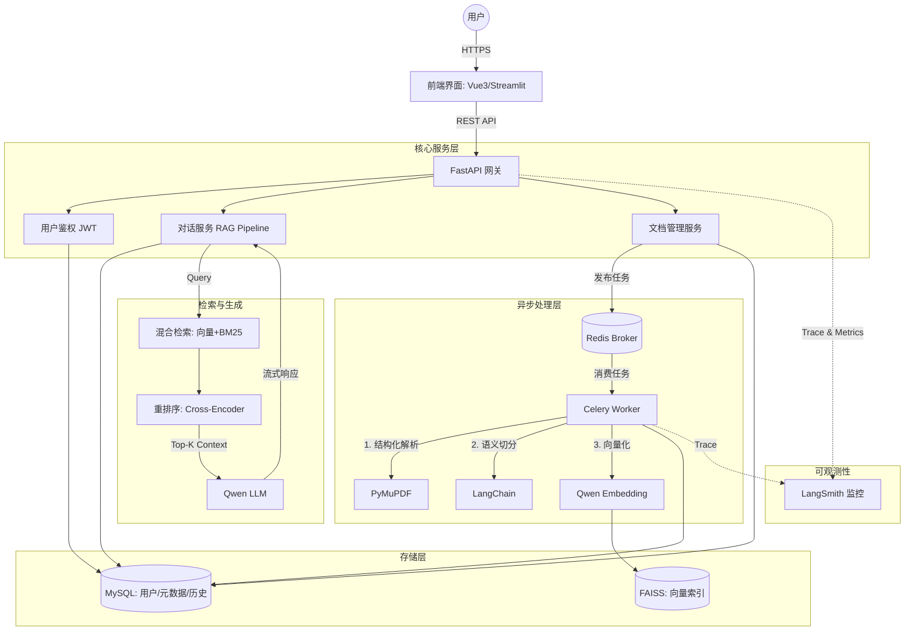

# AI 企业知识库问答系统 (Enterprise RAG System) 架构说明书

## 1. 项目背景与演进
传统的 RAG（检索增强生成）系统通常停留在 Demo 阶段：同步处理导致接口超时、简单的文本切分破坏了文档语义、单一的向量检索在面对专有名词时频频失效，且系统宛如黑盒，无法排查 Bad Case。

本项目旨在构建一个**企业级、高可用、可观测**的 RAG 知识库问答系统。不仅实现了基础的文档问答，更在**文档解析、混合检索、异步工程化、全链路追踪**四个维度进行了深度优化，以满足真实企业场景下的严苛要求。

## 2. 核心架构与数据流转

系统采用前后端分离架构，后端引入异步任务队列以应对耗时操作，并集成了全链路追踪系统。

## 3. 关键技术优化与面试考点

### 3.1 复杂文档结构化解析
*   **传统痛点**：`PyPDFLoader` 按页提取纯文本，丢失了表格、多级标题等关键结构信息，导致大模型无法理解层级关系。
*   **优化方案**：采用 **PyMuPDF (fitz)** 进行深度解析。提取文本的同时保留标题层级（H1, H2, H3），并将表格转换为 Markdown 格式。
*   **工程价值**：大幅提升了结构化数据（如公司规章制度、财务报表）的问答准确率。

### 3.2 语义切分与父子文档策略 (Parent-Child Retriever)
*   **传统痛点**：固定长度（如 500 字符）切分容易将完整的段落或句子截断，导致上下文丢失。
*   **优化方案**：
    1.  **语义切分**：基于解析出的 Markdown 标题层级进行切分 (`MarkdownHeaderTextSplitter`)，确保每个 Chunk 都是一个完整的知识块。
    2.  **父子文档**：将大块文档（Parent）切分为小块（Child）进行 Embedding 存储。检索时命中 Child，但将包含完整上下文的 Parent 喂给大模型。兼顾了检索的精准度与生成的上下文丰富度。

### 3.3 混合检索与重排序 (Hybrid Search + Reranking)
*   **传统痛点**：单一的 FAISS 向量检索对“专有名词”（如员工工号、特定产品型号）极度不敏感。
*   **优化方案**：
    1.  **双路召回**：结合 FAISS（语义相似度）与 关键词检索（BM25），取两路召回的并集。
    2.  **Reranker 重排**：使用 Cross-Encoder 模型（如 Qwen Reranker 或 bge-reranker）对召回的 Top-50 文档块进行二次精准打分，截取 Top-5 输入大模型。
*   **工程价值**：解决了 RAG 系统的“最后一公里”问题，显著降低了幻觉（Hallucination）。

### 3.4 异步工程化与状态机设计
*   **传统痛点**：上传百页 PDF 时，同步解析和向量化会导致 HTTP 请求超时（Timeout）。
*   **优化方案**：引入 **FastAPI BackgroundTasks / Celery + Redis**。
    *   上传接口即时返回 `task_id`。
    *   数据库 `document` 表引入状态机：`PENDING` -> `PROCESSING` -> `COMPLETED` / `FAILED`。
    *   前端通过轮询或 WebSocket 获取处理进度。
*   **工程价值**：展现了应对高并发和耗时任务的生产级架构设计能力。

### 3.5 全链路可观测性 (Observability)
*   **传统痛点**：系统是个黑盒，回答错误时不知道是检索没召回，还是大模型理解错误。
*   **优化方案**：无缝接入 **LangSmith**。记录每一次请求的 Trace，包括：Query 改写、检索耗时、召回的 Chunk 及得分、Prompt 拼装过程、Token 消耗及大模型延迟。
*   **工程价值**：具备生产环境的 Debug 和持续迭代能力。

## 4. 数据库设计 (核心表结构)

在原有基础上增加了状态机、会话管理和更丰富的元数据：

1.  **`users`**: 用户表 (id, username, password_hash, role, created_at)
2.  **`documents`**: 文档元数据表 (id, user_id, filename, file_path, status [PENDING/PROCESSING/COMPLETED/FAILED], chunk_count, error_msg, created_at)
3.  **`chat_sessions`**: 对话会话表 (id, user_id, title, created_at, updated_at) - *用于支持左侧历史对话列表*
4.  **`chat_history`**: 对话明细表 (id, session_id, user_id, role [user/assistant], content, sources [JSON格式存储引用来源], created_at)

## 5. 技术栈全景

| 领域 | 技术选型 | 版本/备注 |
| :--- | :--- | :--- |
| **后端框架** | Python + FastAPI | 异步高性能，自动 OpenAPI 文档 |
| **异步任务** | Celery + Redis | 解决耗时文档解析阻塞主线程问题 |
| **关系型数据库** | MySQL + SQLAlchemy 2.0 | 核心业务数据存储，采用异步驱动 `asyncmy` |
| **向量数据库** | FAISS | 本地高性能向量检索，支持持久化 |
| **文档解析** | PyMuPDF + Unstructured | 复杂 PDF、表格、层级结构提取 |
| **大模型服务** | Qwen API (通义千问) | 包含 LLM 生成、Embedding 向量化、Reranker 重排 |
| **AI 编排** | LangChain | LCEL 语法构建 RAG 流水线 |
| **可观测性** | LangSmith | Prompt 管理、链路追踪、效果评估 |
| **容器化部署** | Docker + Docker Compose | 一键拉起 API, Worker, MySQL, Redis |

## 6. 项目验收与交付标准

除了基础功能跑通，本项目的交付标准对齐企业级要求：
1.  **工程规范**：代码遵循 PEP8，包含类型提示 (Type Hints)，核心逻辑有 Pytest 单元测试覆盖。
2.  **健壮性**：全局异常处理，统一的 API 响应格式，文档上传大小限制与格式校验。
3.  **可部署性**：提供完善的 `docker-compose.yml`，包含环境变量配置 (`.env.example`)，一条命令即可启动完整集群。
4.  **用户体验**：流式输出 (Streaming Response) 大模型答案，引用来源支持点击高亮定位。
